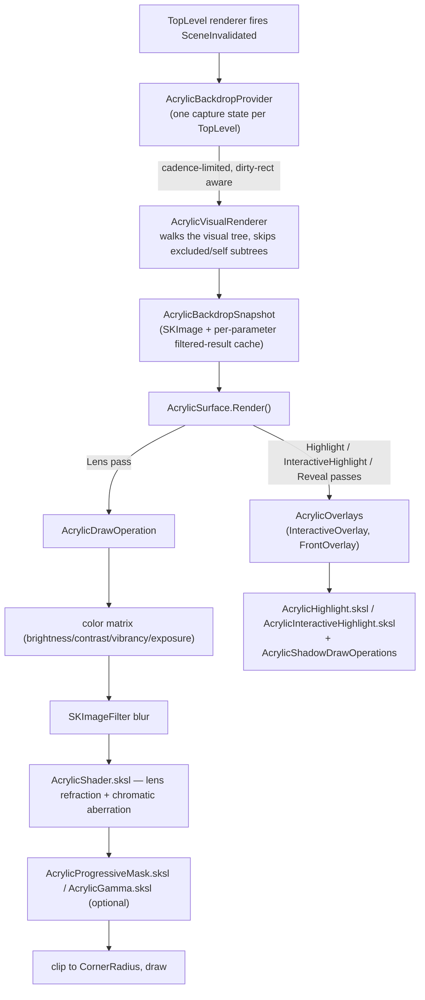

# Architecture

`Fluid.Avalonia.Acrylic` is a cross-platform, software-rendered acrylic / frosted-glass
backdrop for Avalonia. The core idea: instead of asking the OS compositor to blur the desktop
behind a window (Windows/macOS-only, no browser), the library captures the app's **own**
rendered content behind a control and blurs/tints/refracts it in a Skia shader pipeline — so
the output is pixel-identical on Windows, macOS, Linux, and WASM.

Everything in the package hangs off two concerns: **getting a snapshot of what's behind a
surface** (capture), and **drawing that snapshot back through a shader chain** (the draw
passes). Interaction (press/drag deformation, pointer-tracked reveal, parallax) is layered on
top of the same primitives, not a separate system.

## Code provenance

`Fluid.Avalonia.Acrylic` started as a renamed, repacked fork of
**[LiquidGlassAvaloniaUI](https://github.com/KaranocaVe/LiquidGlassAvaloniaUI)** by KaranocaVe
(MIT) — see the [README credits](../README.md#credits). It isn't a simple fork anymore. The
core glass pipeline (backdrop capture, the draw operation, shadow/highlight overlays, path
utils, diagnostics) is still inherited from that fork, but on top of it the library now carries
an Avalonia-12 compatibility pass, a code-review hardening pass (resource leaks, detach-state
resets, reflection-cache races, capture liveness/thread safety), and — with no upstream
equivalent at all — `AcrylicRevealBroadcaster` and `AcrylicParallaxSurface`.

Neither Reveal nor Parallax was ported from anywhere; both were built natively against the
existing draw pipeline. The idea for each is conceptually modeled on FluentWPF's
`PointerTracker`/Reveal effect and `ParallaxView` respectively — WPF concepts, not portable
code. Benchmarking against **[DaisyGlass](https://github.com/tobitege/Flowery.NET)**, the
closest real Avalonia peer, is what motivated building them as differentiators in the first
place: DaisyGlass has no pointer interaction of any kind (confirmed by reading its source — no
`PointerPressed`/`PointerMoved` handling anywhere, no hover or reveal styling), so a
spring-physics deformation plus a shared-broadcaster reveal highlight is genuine, uncontested
territory in the Avalonia ecosystem, not a copy of anything DaisyGlass does.

## The rendering pipeline

Two things make this cheaper than "recapture and re-filter every frame":

- **Capture is cadence- and dirty-rect-limited.** `AcrylicBackdropProvider` only queues a
  recapture when the scene actually changed, throttled to ~33ms, and skips entirely when a
  surface has no subscribers left.
- **Filtered results are cached per parameter set.** `AcrylicBackdropSnapshot` keys the
  blurred/color-adjusted output on a quantized hash of brightness/contrast/vibrancy/exposure/
  opacity/blur-radius/crop-rect, so dragging a slider or an idle static scene doesn't re-run
  the filter chain — and an identity fast-path skips it altogether when every parameter is at
  its no-op default.

## Public API

- **`AcrylicSurface`** — `ContentControl` driving the pipeline above. Properties fall into
  groups: backdrop sampling (`BlurRadius`, `Vibrancy`, `Brightness`, `Contrast`, `ExposureEv`,
  `GammaPower`, `BackdropZoom`/`Offset`/`Opacity`), lens (`RefractionHeight`/`Amount`,
  `DepthEffect`, `ChromaticAberration`), color (`TintColor`, `SurfaceColor`), progressive blur
  (`ProgressiveBlur*`), adaptive luminance (`AdaptiveLuminance*` — samples the backdrop and
  auto-tone-maps), highlight/shadow (`Highlight*`, `Shadow*`, `InnerShadow*`), and reveal
  (`RevealBorder*`, `RevealProximityDistance`).
- **`AcrylicInteractiveSurface : AcrylicSurface`** — adds spring-physics press/drag deformation
  (`IsInteractive`, `InteractiveMaxScaleDip`, `DeformOnRightButton`) and a radial press
  highlight.
- **`AcrylicParallaxSurface : AcrylicSurface`** — shifts `BackdropOffset` by a fraction of the
  pointer's offset from center (`IsParallaxEnabled`, `ParallaxStrength`). No new sampling
  infrastructure — it drives an existing property.
- **`AcrylicBackdrop`** — one attached property, `IsExcludedFromCapture`, to keep a subtree
  (e.g. debug overlays) out of the backdrop snapshot.
- **`AcrylicAppBuilderExtensions.UseAcrylicPerformanceDefaults()`** — opinionated
  `CompositionOptions`/`SkiaOptions` (region dirty-rect clipping, a GPU resource cap) tuned for
  this pipeline.

## Module map

| Area | Files | Role |
|---|---|---|
| Core surfaces | `AcrylicSurface`, `AcrylicInteractiveSurface`, `AcrylicParallaxSurface` | Public controls; own the styled properties and per-frame `AcrylicDrawParameters` assembly |
| Backdrop capture | `AcrylicBackdropProvider`, `AcrylicBackdropSnapshot`, `AcrylicVisualRenderer`, `AcrylicBackdrop` | Per-`TopLevel` capture state, the snapshot + filtered-result cache, the manual visual-tree walk used to render the capture, and the capture-exclusion attached property |
| Draw operations & shaders | `AcrylicDrawOperation`, `AcrylicDrawParameters`, `AcrylicShadowDrawOperations`, `AcrylicPathUtils`, `Assets/Shaders/*.sksl` | The `ICustomDrawOperation` implementations and the six `SKRuntimeEffect` shaders (lens, highlight, interactive highlight, progressive mask, gamma, backdrop transform) |
| Overlays | `AcrylicOverlays` | Template parts (`InteractiveOverlay`, `FrontOverlay`) that trigger the highlight/shadow/reveal draw passes after content renders |
| Interaction | `AcrylicRevealBroadcaster` (in `AcrylicInteractiveSurface`'s and `AcrylicSurface`'s draw-parameter/pointer plumbing) | One shared `TopLevel` pointer subscription fanning out to every reveal-enabled surface, with proximity falloff |
| Diagnostics | `AcrylicDiagnostics` | Counters for capture/filter cache behavior, useful when tuning `UseAcrylicPerformanceDefaults()` |
| Startup | `AcrylicAppBuilderExtensions` | The `AppBuilder` extension for tuned Composition/Skia defaults |

## Coordinate spaces

The pipeline crosses three coordinate systems per frame, and most of the subtler bugs in this
codebase (see the hardening commits) trace back to conflating them:

1. **DIPs, control-local** — what `Bounds`, styled properties like `BackdropOffset`, and shader
   uniforms like `size`/`position` are expressed in. `(0,0)` is the control's top-left.
2. **DIPs, `TopLevel`-local** — what `AcrylicRevealBroadcaster` and the interactive pointer
   hooks work in before transforming down to a specific surface via
   `Visual.TransformToVisual(...)` (which maps a point from the *source* visual's local space
   into the *target* visual's local space — not the other way around, easy to get backwards).
3. **Device pixels, snapshot-local** — what `AcrylicBackdropSnapshot.OriginInPixels` and the
   filter crop rect (`AcrylicDrawOperation.CalculateFilterCrop`) are expressed in, scaled by
   `TopLevel.RenderScaling` and offset by wherever the snapshot's capture region started.

The shader-facing code (`RenderLens`, `RenderReveal`, `RenderHighlight`) always works in
coordinate space 1 for uniforms, and reconciles space 3 via `WithPixelOrigin` — a matrix that
cancels the canvas's current transform and re-offsets into the snapshot's own pixel origin —
rather than by scaling coordinates by hand.
